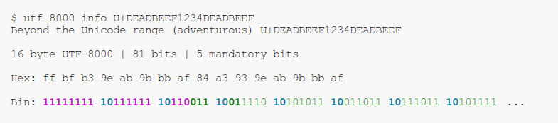

# UTF-8000

Unlimited UTF-8!

ASCII ⊆ UTF-8 ⊆ UTF-8000

- UTF-8000 is the correct way to expand UTF-8 indefinitely.
- This repository contains a Python implementation of UTF-8000.
- See [UTF-8000-Website](https://github.com/UTF-8000/UTF-8000-Website) for the full writeup.
- UTF-8000 is in no way endorsed by or representative of the [Unicode Consortium](https://home.unicode.org/). This is a standalone project.

## Installing

Available on PyPI as [UTF-8000](https://pypi.org/project/UTF-8000/)

Recommended install using [pipx](https://github.com/pypa/pipx):

```
$ pipx install UTF-8000
```

provides

```
utf-8000(1)
```

with subcommands

```
utf-8000 info
utf-8000 encode
utf-8000 decode
```

## TLDR Examples

### Using `utf-8000 info`



### Color key:

- Bright Magenta: start sequence bits `111...110`
- Bright Cyan: continuation byte prefix `10`
- Bright Green: mandatory content bits
- Green: content bits

Observe the first byte completely filled with 1s from the start sequence bits. The start sequence bits continue on into the continuation bytes, the first also being completely filled. The third byte contains the end of the start sequence bits, that is the two 1s and the terminating 0. The five mandatory content bits are in bright green, and the rest of the content is in green. Notice that at least one of the 'mandatory content bits' is a 1 to avoid an overlong encoding.

### Using `utf-8000 encode`

```
$ echo 'U+DEADBEEFBADF00D' | utf-8000 encode | hexdump -C
00000000  ff bc b7 aa b6 be bb bb  ab 9f 80 8d              |............|
0000000c
```

### Using `utf-8000 decode`

Using the bytes from the encode example above

```
$ echo -ne '\xff\xbc\xb7\xaa\xb6\xbe\xbb\xbb\xab\x9f\x80\x8d' | utf-8000 decode
U+DEADBEEFBADF00D
```

Or another example

```
$ echo 'שלום' | utf-8000 decode
U+05E9
U+05DC
U+05D5
U+05DD
U+000A
```

## Package Contents

- encode.py
  - `encode(x: int) -> bytes`: Encode an unsigned integer in UTF-8000 and return the bytes
  - `fancy_encode(x: int) -> tuple[UTF8000Byte]`: Encode an unsigned integer in UTF-8000 and return 'fancy' `UTF8000Byte`s, useful for education and inspection.
- decode.py
  - `UTF8000IncrementalDecoder`: An incremental decoder class that can be fed bytes, and can be iterated over, yielding `UTF8000Int`s when full byte sequences have been supplied and decoded.
- UTF8000Byte.py
  - `UTF8000Byte`: a 'fancy' byte wrapper around UTF-8000 bytes that
  - Various constants and utility functions

## See Also

The main UTF-8000 specification, including how to derive it, history, statistics, trivia, rejected alternatives etc is located at [UTF-8000-Website](https://github.com/UTF-8000/UTF-8000-Website), hosted at [utf-8000.jb2170.com](https://utf-8000.jb2170.com/).
